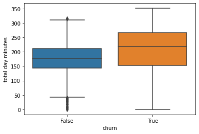
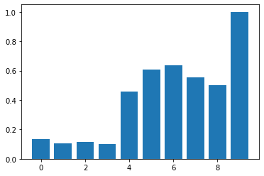
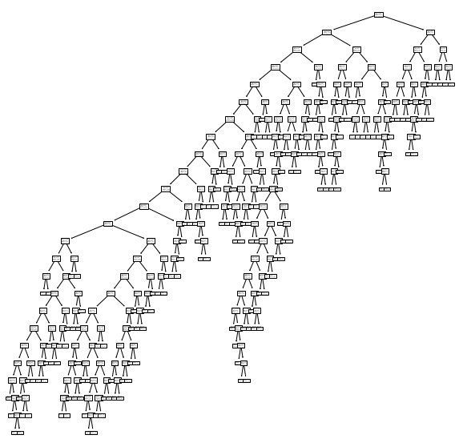
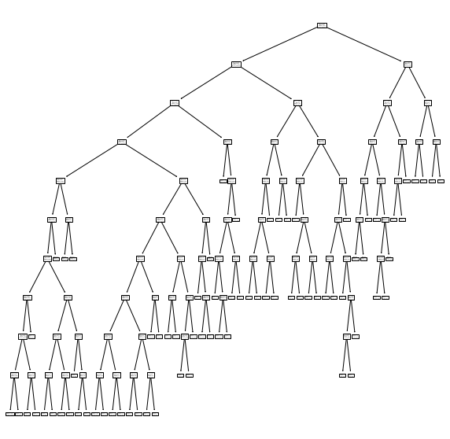
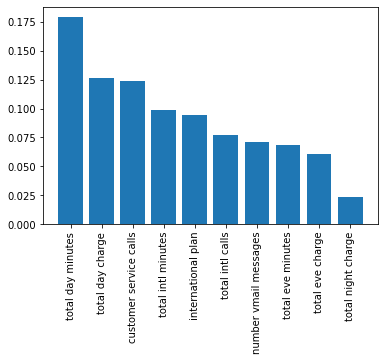

# Telecom's Churn Analysis
This project attempts to predict whether a customer will churn or not depending on the characters of their involvement with SyriaTel, a telecommunications company.

## Tech Stack
- Python
- Pandas
- Matplotlib
- Seaborn
- scikit-learn

## EDA
Data used was [SyriaTel Customer Churn](https://www.kaggle.com/becksddf/churn-in-telecoms-dataset) from Kaggle. The data was cleaned, analyzed and categorical data was label and one-hot encoded.

We can look at a heatmap of the data upon import:

We can look at the correlation between a customer churning and and the total minutes spent on the phone during the day: 

We can also visualize the likelihood a customer will churn based off of how many calls they receive (calls on the x-axis and likelihood of churning on the y-axis): 

## Modeling
We created and applied two models to the data:
1. Logistic Regression
2. Decision Tree

### Feature Selection
We decided to use most of the features provided in the data. The only features removed was the phone number as there can be no meaningful relationship between a customer's phone number and their likelihood to churn due to every customer having a unique phone number anyways.
We label encoded area code, and followed that by one-hot encoding the states from their letter code to a readable numerical value. We also converted the `yes` `no` values to `1` or `0` respectively.

We started with this: 

<table border="1" class="dataframe">
  <thead>
    <tr style="text-align: right;">
      <th></th>
      <th>state</th>
      <th>account length</th>
      <th>area code</th>
      <th>phone number</th>
      <th>international plan</th>
      <th>voice mail plan</th>
      <th>number vmail messages</th>
      <th>total day minutes</th>
      <th>total day calls</th>
      <th>total day charge</th>
      <th>total eve minutes</th>
      <th>total eve calls</th>
      <th>total eve charge</th>
      <th>total night minutes</th>
      <th>total night calls</th>
      <th>total night charge</th>
      <th>total intl minutes</th>
      <th>total intl calls</th>
      <th>total intl charge</th>
      <th>customer service calls</th>
      <th>churn</th>
    </tr>
  </thead>
  <tbody>
    <tr>
      <th>0</th>
      <td>KS</td>
      <td>128</td>
      <td>415</td>
      <td>382-4657</td>
      <td>no</td>
      <td>yes</td>
      <td>25</td>
      <td>265.1</td>
      <td>110</td>
      <td>45.07</td>
      <td>197.4</td>
      <td>99</td>
      <td>16.78</td>
      <td>244.7</td>
      <td>91</td>
      <td>11.01</td>
      <td>10.0</td>
      <td>3</td>
      <td>2.70</td>
      <td>1</td>
      <td>False</td>
    </tr>
    <tr>
      <th>1</th>
      <td>OH</td>
      <td>107</td>
      <td>415</td>
      <td>371-7191</td>
      <td>no</td>
      <td>yes</td>
      <td>26</td>
      <td>161.6</td>
      <td>123</td>
      <td>27.47</td>
      <td>195.5</td>
      <td>103</td>
      <td>16.62</td>
      <td>254.4</td>
      <td>103</td>
      <td>11.45</td>
      <td>13.7</td>
      <td>3</td>
      <td>3.70</td>
      <td>1</td>
      <td>False</td>
    </tr>
    <tr>
      <th>2</th>
      <td>NJ</td>
      <td>137</td>
      <td>415</td>
      <td>358-1921</td>
      <td>no</td>
      <td>no</td>
      <td>0</td>
      <td>243.4</td>
      <td>114</td>
      <td>41.38</td>
      <td>121.2</td>
      <td>110</td>
      <td>10.30</td>
      <td>162.6</td>
      <td>104</td>
      <td>7.32</td>
      <td>12.2</td>
      <td>5</td>
      <td>3.29</td>
      <td>0</td>
      <td>False</td>
    </tr>
    <tr>
      <th>3</th>
      <td>OH</td>
      <td>84</td>
      <td>408</td>
      <td>375-9999</td>
      <td>yes</td>
      <td>no</td>
      <td>0</td>
      <td>299.4</td>
      <td>71</td>
      <td>50.90</td>
      <td>61.9</td>
      <td>88</td>
      <td>5.26</td>
      <td>196.9</td>
      <td>89</td>
      <td>8.86</td>
      <td>6.6</td>
      <td>7</td>
      <td>1.78</td>
      <td>2</td>
      <td>False</td>
    </tr>
    <tr>
      <th>4</th>
      <td>OK</td>
      <td>75</td>
      <td>415</td>
      <td>330-6626</td>
      <td>yes</td>
      <td>no</td>
      <td>0</td>
      <td>166.7</td>
      <td>113</td>
      <td>28.34</td>
      <td>148.3</td>
      <td>122</td>
      <td>12.61</td>
      <td>186.9</td>
      <td>121</td>
      <td>8.41</td>
      <td>10.1</td>
      <td>3</td>
      <td>2.73</td>
      <td>3</td>
      <td>False</td>
    </tr>
  </tbody>
</table>

And ended with this:

<table border="1" class="dataframe">
  <thead>
    <tr style="text-align: right;">
      <th></th>
      <th>account length</th>
      <th>area code</th>
      <th>international plan</th>
      <th>voice mail plan</th>
      <th>number vmail messages</th>
      <th>total day minutes</th>
      <th>total day calls</th>
      <th>total day charge</th>
      <th>total eve minutes</th>
      <th>total eve calls</th>
      <th>total eve charge</th>
      <th>total night minutes</th>
      <th>total night calls</th>
      <th>total night charge</th>
      <th>total intl minutes</th>
      <th>total intl calls</th>
      <th>total intl charge</th>
      <th>customer service calls</th>
      <th>churn</th>
      <th>AK</th>
      <th>AL</th>
      <th>AR</th>
      <th>AZ</th>
      <th>CA</th>
      <th>CO</th>
      <th>CT</th>
      <th>DC</th>
      <th>DE</th>
      <th>FL</th>
      <th>GA</th>
      <th>HI</th>
      <th>IA</th>
      <th>ID</th>
      <th>IL</th>
      <th>IN</th>
      <th>KS</th>
      <th>KY</th>
      <th>LA</th>
      <th>MA</th>
      <th>MD</th>
      <th>ME</th>
      <th>MI</th>
      <th>MN</th>
      <th>MO</th>
      <th>MS</th>
      <th>MT</th>
      <th>NC</th>
      <th>ND</th>
      <th>NE</th>
      <th>NH</th>
      <th>NJ</th>
      <th>NM</th>
      <th>NV</th>
      <th>NY</th>
      <th>OH</th>
      <th>OK</th>
      <th>OR</th>
      <th>PA</th>
      <th>RI</th>
      <th>SC</th>
      <th>SD</th>
      <th>TN</th>
      <th>TX</th>
      <th>UT</th>
      <th>VA</th>
      <th>VT</th>
      <th>WA</th>
      <th>WI</th>
      <th>WV</th>
      <th>WY</th>
    </tr>
  </thead>
  <tbody>
    <tr>
      <th>0</th>
      <td>128</td>
      <td>1</td>
      <td>0</td>
      <td>1</td>
      <td>25</td>
      <td>265.1</td>
      <td>110</td>
      <td>45.07</td>
      <td>197.4</td>
      <td>99</td>
      <td>16.78</td>
      <td>244.7</td>
      <td>91</td>
      <td>11.01</td>
      <td>10.0</td>
      <td>3</td>
      <td>2.70</td>
      <td>1</td>
      <td>False</td>
      <td>0.0</td>
      <td>0.0</td>
      <td>0.0</td>
      <td>0.0</td>
      <td>0.0</td>
      <td>0.0</td>
      <td>0.0</td>
      <td>0.0</td>
      <td>0.0</td>
      <td>0.0</td>
      <td>0.0</td>
      <td>0.0</td>
      <td>0.0</td>
      <td>0.0</td>
      <td>0.0</td>
      <td>0.0</td>
      <td>1.0</td>
      <td>0.0</td>
      <td>0.0</td>
      <td>0.0</td>
      <td>0.0</td>
      <td>0.0</td>
      <td>0.0</td>
      <td>0.0</td>
      <td>0.0</td>
      <td>0.0</td>
      <td>0.0</td>
      <td>0.0</td>
      <td>0.0</td>
      <td>0.0</td>
      <td>0.0</td>
      <td>0.0</td>
      <td>0.0</td>
      <td>0.0</td>
      <td>0.0</td>
      <td>0.0</td>
      <td>0.0</td>
      <td>0.0</td>
      <td>0.0</td>
      <td>0.0</td>
      <td>0.0</td>
      <td>0.0</td>
      <td>0.0</td>
      <td>0.0</td>
      <td>0.0</td>
      <td>0.0</td>
      <td>0.0</td>
      <td>0.0</td>
      <td>0.0</td>
      <td>0.0</td>
      <td>0.0</td>
    </tr>
    <tr>
      <th>1</th>
      <td>107</td>
      <td>1</td>
      <td>0</td>
      <td>1</td>
      <td>26</td>
      <td>161.6</td>
      <td>123</td>
      <td>27.47</td>
      <td>195.5</td>
      <td>103</td>
      <td>16.62</td>
      <td>254.4</td>
      <td>103</td>
      <td>11.45</td>
      <td>13.7</td>
      <td>3</td>
      <td>3.70</td>
      <td>1</td>
      <td>False</td>
      <td>0.0</td>
      <td>0.0</td>
      <td>0.0</td>
      <td>0.0</td>
      <td>0.0</td>
      <td>0.0</td>
      <td>0.0</td>
      <td>0.0</td>
      <td>0.0</td>
      <td>0.0</td>
      <td>0.0</td>
      <td>0.0</td>
      <td>0.0</td>
      <td>0.0</td>
      <td>0.0</td>
      <td>0.0</td>
      <td>0.0</td>
      <td>0.0</td>
      <td>0.0</td>
      <td>0.0</td>
      <td>0.0</td>
      <td>0.0</td>
      <td>0.0</td>
      <td>0.0</td>
      <td>0.0</td>
      <td>0.0</td>
      <td>0.0</td>
      <td>0.0</td>
      <td>0.0</td>
      <td>0.0</td>
      <td>0.0</td>
      <td>0.0</td>
      <td>0.0</td>
      <td>0.0</td>
      <td>0.0</td>
      <td>1.0</td>
      <td>0.0</td>
      <td>0.0</td>
      <td>0.0</td>
      <td>0.0</td>
      <td>0.0</td>
      <td>0.0</td>
      <td>0.0</td>
      <td>0.0</td>
      <td>0.0</td>
      <td>0.0</td>
      <td>0.0</td>
      <td>0.0</td>
      <td>0.0</td>
      <td>0.0</td>
      <td>0.0</td>
    </tr>
    <tr>
      <th>2</th>
      <td>137</td>
      <td>1</td>
      <td>0</td>
      <td>0</td>
      <td>0</td>
      <td>243.4</td>
      <td>114</td>
      <td>41.38</td>
      <td>121.2</td>
      <td>110</td>
      <td>10.30</td>
      <td>162.6</td>
      <td>104</td>
      <td>7.32</td>
      <td>12.2</td>
      <td>5</td>
      <td>3.29</td>
      <td>0</td>
      <td>False</td>
      <td>0.0</td>
      <td>0.0</td>
      <td>0.0</td>
      <td>0.0</td>
      <td>0.0</td>
      <td>0.0</td>
      <td>0.0</td>
      <td>0.0</td>
      <td>0.0</td>
      <td>0.0</td>
      <td>0.0</td>
      <td>0.0</td>
      <td>0.0</td>
      <td>0.0</td>
      <td>0.0</td>
      <td>0.0</td>
      <td>0.0</td>
      <td>0.0</td>
      <td>0.0</td>
      <td>0.0</td>
      <td>0.0</td>
      <td>0.0</td>
      <td>0.0</td>
      <td>0.0</td>
      <td>0.0</td>
      <td>0.0</td>
      <td>0.0</td>
      <td>0.0</td>
      <td>0.0</td>
      <td>0.0</td>
      <td>0.0</td>
      <td>1.0</td>
      <td>0.0</td>
      <td>0.0</td>
      <td>0.0</td>
      <td>0.0</td>
      <td>0.0</td>
      <td>0.0</td>
      <td>0.0</td>
      <td>0.0</td>
      <td>0.0</td>
      <td>0.0</td>
      <td>0.0</td>
      <td>0.0</td>
      <td>0.0</td>
      <td>0.0</td>
      <td>0.0</td>
      <td>0.0</td>
      <td>0.0</td>
      <td>0.0</td>
      <td>0.0</td>
    </tr>
    <tr>
      <th>3</th>
      <td>84</td>
      <td>0</td>
      <td>1</td>
      <td>0</td>
      <td>0</td>
      <td>299.4</td>
      <td>71</td>
      <td>50.90</td>
      <td>61.9</td>
      <td>88</td>
      <td>5.26</td>
      <td>196.9</td>
      <td>89</td>
      <td>8.86</td>
      <td>6.6</td>
      <td>7</td>
      <td>1.78</td>
      <td>2</td>
      <td>False</td>
      <td>0.0</td>
      <td>0.0</td>
      <td>0.0</td>
      <td>0.0</td>
      <td>0.0</td>
      <td>0.0</td>
      <td>0.0</td>
      <td>0.0</td>
      <td>0.0</td>
      <td>0.0</td>
      <td>0.0</td>
      <td>0.0</td>
      <td>0.0</td>
      <td>0.0</td>
      <td>0.0</td>
      <td>0.0</td>
      <td>0.0</td>
      <td>0.0</td>
      <td>0.0</td>
      <td>0.0</td>
      <td>0.0</td>
      <td>0.0</td>
      <td>0.0</td>
      <td>0.0</td>
      <td>0.0</td>
      <td>0.0</td>
      <td>0.0</td>
      <td>0.0</td>
      <td>0.0</td>
      <td>0.0</td>
      <td>0.0</td>
      <td>0.0</td>
      <td>0.0</td>
      <td>0.0</td>
      <td>0.0</td>
      <td>1.0</td>
      <td>0.0</td>
      <td>0.0</td>
      <td>0.0</td>
      <td>0.0</td>
      <td>0.0</td>
      <td>0.0</td>
      <td>0.0</td>
      <td>0.0</td>
      <td>0.0</td>
      <td>0.0</td>
      <td>0.0</td>
      <td>0.0</td>
      <td>0.0</td>
      <td>0.0</td>
      <td>0.0</td>
    </tr>
    <tr>
      <th>4</th>
      <td>75</td>
      <td>1</td>
      <td>1</td>
      <td>0</td>
      <td>0</td>
      <td>166.7</td>
      <td>113</td>
      <td>28.34</td>
      <td>148.3</td>
      <td>122</td>
      <td>12.61</td>
      <td>186.9</td>
      <td>121</td>
      <td>8.41</td>
      <td>10.1</td>
      <td>3</td>
      <td>2.73</td>
      <td>3</td>
      <td>False</td>
      <td>0.0</td>
      <td>0.0</td>
      <td>0.0</td>
      <td>0.0</td>
      <td>0.0</td>
      <td>0.0</td>
      <td>0.0</td>
      <td>0.0</td>
      <td>0.0</td>
      <td>0.0</td>
      <td>0.0</td>
      <td>0.0</td>
      <td>0.0</td>
      <td>0.0</td>
      <td>0.0</td>
      <td>0.0</td>
      <td>0.0</td>
      <td>0.0</td>
      <td>0.0</td>
      <td>0.0</td>
      <td>0.0</td>
      <td>0.0</td>
      <td>0.0</td>
      <td>0.0</td>
      <td>0.0</td>
      <td>0.0</td>
      <td>0.0</td>
      <td>0.0</td>
      <td>0.0</td>
      <td>0.0</td>
      <td>0.0</td>
      <td>0.0</td>
      <td>0.0</td>
      <td>0.0</td>
      <td>0.0</td>
      <td>0.0</td>
      <td>1.0</td>
      <td>0.0</td>
      <td>0.0</td>
      <td>0.0</td>
      <td>0.0</td>
      <td>0.0</td>
      <td>0.0</td>
      <td>0.0</td>
      <td>0.0</td>
      <td>0.0</td>
      <td>0.0</td>
      <td>0.0</td>
      <td>0.0</td>
      <td>0.0</td>
      <td>0.0</td>
    </tr>
  </tbody>
</table>

### Logistical Regression
The first model we created was the Logistic Regression model. The model was solid but not fantastic. When cross validated, the accuracy of the model was `0.8667475452748684`

We can do better.

### Decision Tree
The next model we created was a Decision Tree. This model was better than the Logistical Regression model with a cross validation accuracy of `0.9062215851199135`. We can see that while this model is **4%** better than the Logistical Regression, it still isn't perfect. The model can be seen overfitting with a training data accuracy of `1.0` and a test data accuracy of `0.9100449775112444`. 
Here's what the tree looks like: 

We can take this model and fine tune the Hyperparameters to see if we can improve the model.

#### Decision Tree Tuned
We will add the following parameters to the Decision Tree and see where it takes us:
- `max_depth=10`
- `min_samples_split=5`
- `min_samples_leaf=2`

Upon fitting the data to this new model we get a cross validation accuracy of `0.9294783959075545` which is slightly better than the first Decission Tree Model. However, where the data really pulls ahead is we are no longer overfitting as much with the following scores: 
- Training: `0.9737434358589647`
- Testing: `0.9400299850074962`

Here's what the tree looks like now:

## Conclusion
The best model that we created and applied is the tuned Decision Tree. These are the data analytics for the model:
- Accuracy :  `0.9400299850074962`
- Recall :  `0.7625`
- F1 score :  `0.7530864197530863`
- Precision :  `0.7439024390243902`

Comparing the normalized value counts for customer's churning or not from the original data: 
- False    `0.855086`
- True     `0.144914`

We can see that the model is a near 9% improvement.

### Revised Feature Selection
We can take a look at the feature importances of the model and find which features are the most impactful for a customer to churn or not. With the graph, it can be seen that the total day minutes are conclusively the most important.

